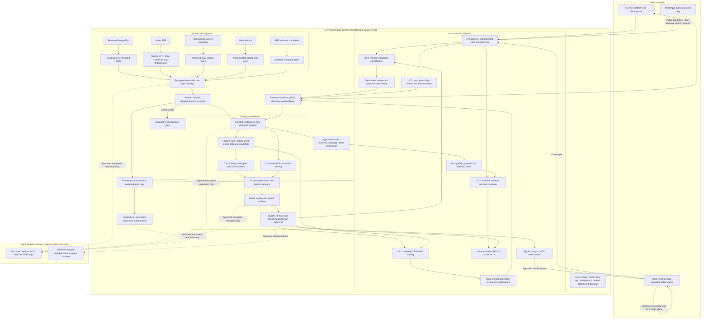
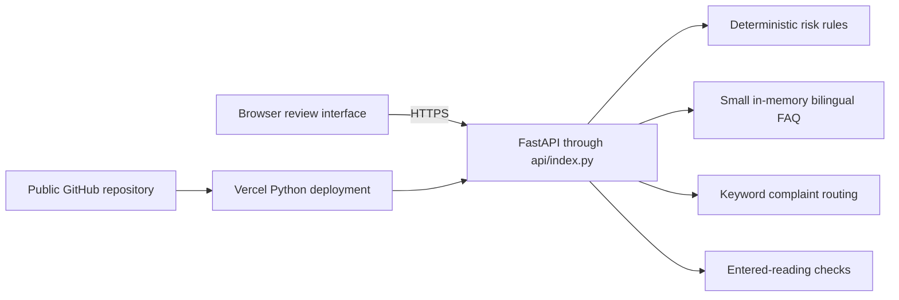

# B3 — RICAP architecture

This is the proposed government deployment for the case study. It is **not** a diagram of services already connected to the public Vercel demo. Officers approve audits and penalties; model outputs are recommendations.

## Proposed production system

Read the main path as: collect data safely, check it, build consistent features, test models, and give officers recommendations. The feedback path captures corrections and completed audit outcomes for later evaluation. Failed data checks stop publication of the affected batch.

The feature store starts as governed SQL and versioned snapshots, not a separate platform to operate. UC1 runs quarterly on CPUs. UC4 starts with a CPU text classifier. UC3 runs a compact detector and digit reader on the phone, stores results securely while offline, and synchronises when a connection is available. UC2 retrieves authorised, current sources before asking the local language model for a cited answer.

WhatsApp is an external channel, so it must be limited to public guidance. Account-specific conversations move to the authenticated portal. Protected taxpayer records never go to public AI APIs. DR replication needs Ministry approval; failover must respect the same approved data-processing boundary and be tested through restore exercises.

## How the two L4 GPUs shape the design

Each L4 has 24 GB; the two cards do not automatically act as one 48 GB memory pool. I would start with a quantised 8B language model on one card and reserve the other for embeddings, reranking and scheduled experiments. UC1 and the initial UC4 classifier run on CPUs; UC3 runs on phones. I would cap context and answer length, batch inference, and cache only authorised public answers. Fifty concurrent users and a five-second response target require a measured load test. If that target fails, I would reduce generation work or agree more capacity before release, rather than promise untested performance.

## What the public demonstration actually connects

The public demo has no database, external LLM, vector database, image OCR, offline mobile app or model registry. It is a synthetic-data interface demonstration. The separate G1 reference service loads the C1 model artifact, but that reference service is not the Vercel application.

## Review links

- [Live demonstration](https://farsight-ricap-ai-assessment.vercel.app/)
- [Public demo API](../app/main.py)
- [C1 training pipeline](train_uc1.py)
- [D2 grounded-answer reference](rag_answer.py)
- [F1 PostgreSQL feature query](uc1_features.sql)
- [G1 artifact-backed serving reference](serve_uc1.py)
- [G2 container](Dockerfile) and [Kubernetes reference](k8s.yaml)

Model candidates must pass Somali-language and workload-specific evaluation. Sources: [Qwen3-8B model card](https://huggingface.co/Qwen/Qwen3-8B) and [BGE-M3 model card](https://huggingface.co/BAAI/bge-m3).
