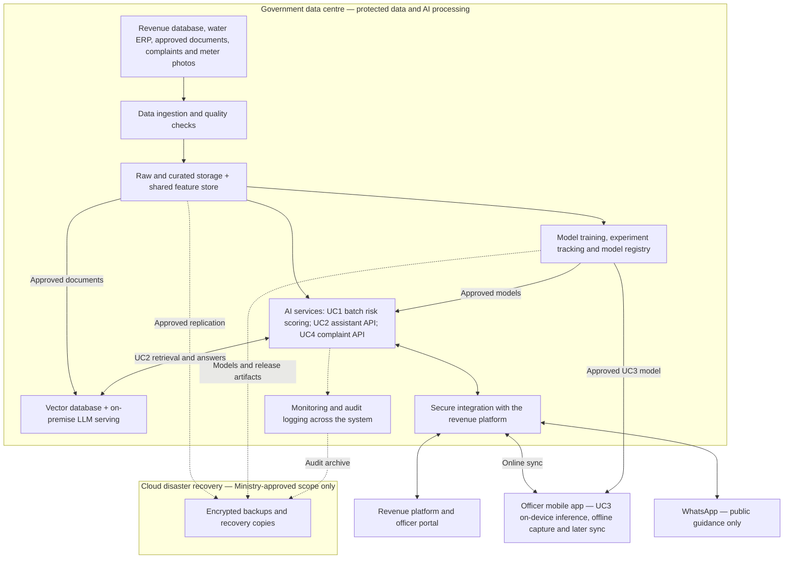

# B3 — RICAP high-level architecture

This is the proposed production architecture, not the services currently connected to the public demo. AI supports officers; officers remain responsible for audits and penalties.

## How to read the design

- **Data:** ingestion brings the source systems together, checks quality and maintains raw records, cleaned data and consistent model features.
- **Models:** training uses the curated data; experiment tracking records results, and the model registry holds approved releases.
- **Serving:** UC1 produces quarterly risk rankings; UC2 and UC4 expose real-time APIs. UC2 uses the vector database and local LLM. UC3 runs on officers' phones and synchronises when connectivity returns.
- **Integration and oversight:** the revenue platform and mobile app support officer decisions. WhatsApp provides public guidance only. Monitoring and audit logging cover ingestion, model releases and operational use.
- **Security boundary:** protected records and central AI processing stay on-premise, with role-based access and encryption. Only Ministry-approved encrypted copies cross into cloud DR; recovery must preserve the same access and processing restrictions.

## How the two L4 GPUs shape the design

Each L4 has 24 GB; the cards do not automatically form one 48 GB memory pool. I would start with a quantised 8B language model on one card and use the other for embeddings, reranking and scheduled experiments. UC1 and the initial UC4 classifier run on CPUs; UC3 runs on phones. Bounded context, batching and caching approved public answers reduce GPU demand. I would test the five-second response target with 50 concurrent users before release, then reduce generation work or agree more capacity if needed.

## Public demo boundary

The [live demonstration](https://farsight-ricap-ai-assessment.vercel.app/) connects a browser interface to a FastAPI application on Vercel, using deterministic rules and a small in-memory FAQ. It does **not** connect the production database, LLM, vector database, image OCR, offline mobile app or model registry shown in the proposed design.
